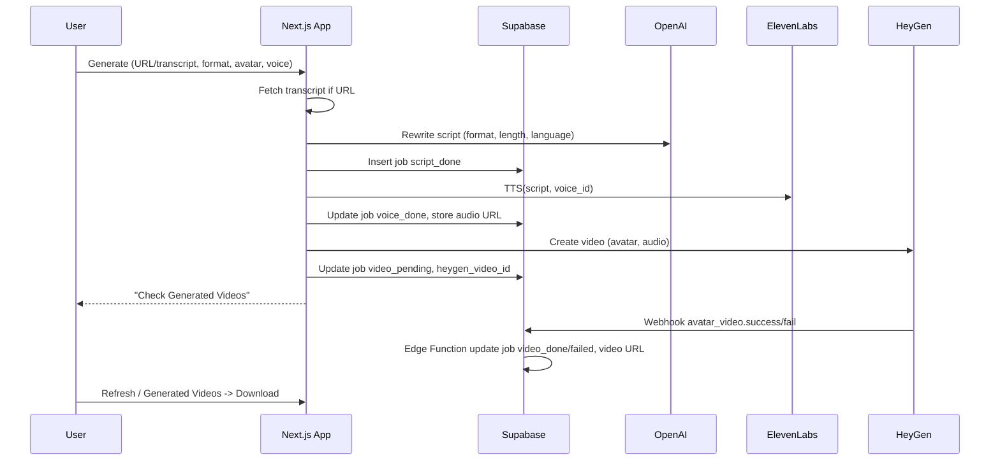
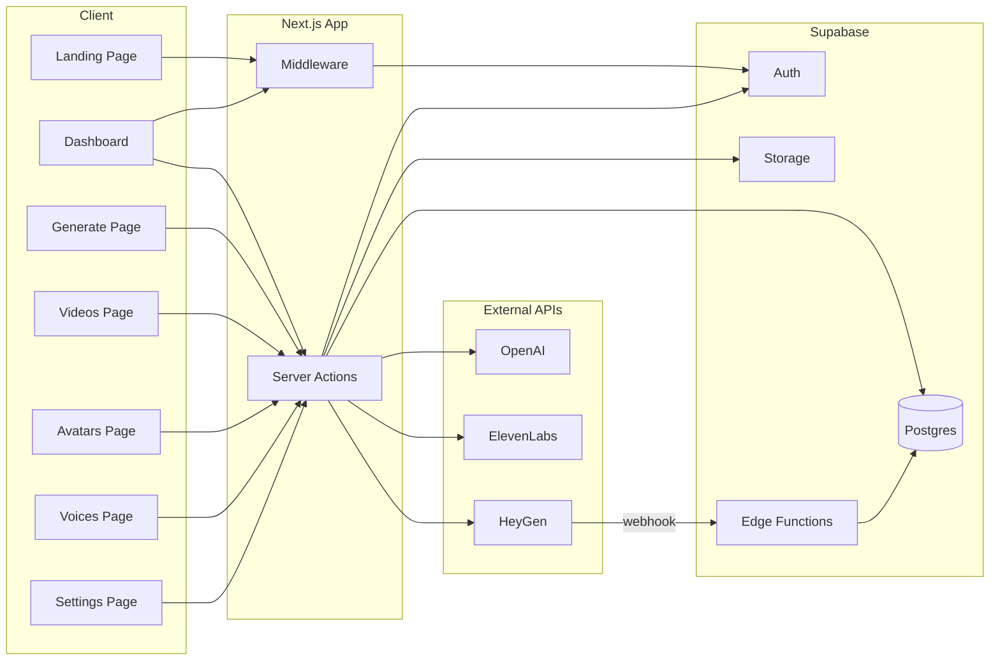

# clonestar — Technical Architecture

This document tracks the technical architecture and design decisions for the AI Avatar Video Studio, aligned with the implementation plan.

---

## 1. Architecture overview

### 1.1 Generate pipeline (sequence)

End-to-end flow from “Generate Video” to downloadable result:

### 1.2 High-level system diagram

---

## 2. Tech stack

| Layer | Technology |
|-------|------------|
| Frontend | Next.js 16 (App Router), React 19, Tailwind, Radix UI |
| Auth & backend | Supabase (Auth, Postgres, Storage, Edge Functions) |
| Script | OpenAI API (gpt-4o-mini) |
| Voice | ElevenLabs Text-to-Speech API |
| Video | HeyGen API (talking photo + audio) |
| Transcript | youtube-transcript (server-side) |
| Client state | React state, sessionStorage (landing draft) |

---

## 3. Data flow summary

### 3.1 Generate pipeline (steps)

1. **Input** — User provides YouTube URL or pasted transcript, plus format (9:16 / 16:9), language, length, avatar, voice.
2. **Transcript** — If URL: `youtube-transcript` fetches captions; else use pasted text.
3. **Script** — OpenAI rewrites/condenses transcript for format, length, and language; returns script + title.
4. **DB** — Insert `generated_videos` row with status `script_done`.
5. **Voice** — ElevenLabs TTS with user’s `provider_voice_id`; upload audio to Storage `generated-videos/{user_id}/{job_id}/audio.mp3`; update row to `voice_done`, set `audio_url`.
6. **Video** — HeyGen `POST /v2/video/generate` with talking photo id, audio URL, dimensions; set status `video_pending`, store `heygen_video_id` and `callback_id` = job id.
7. **Webhook** — HeyGen calls Edge Function on `avatar_video.success` / `avatar_video.fail`; function updates row to `video_done` (with `video_url`) or `failed` (with `error_message`).

### 3.2 Auth and routing

- **Middleware** — Refreshes Supabase session (cookies), redirects unauthenticated users from `/dashboard/*` to `/`.
- **Landing** — Generate form state (URL, format, language, length) saved to `sessionStorage` before opening login; after login, redirect to `/dashboard/generate`; Generate page reads draft from `sessionStorage` and clears it.

---

## 4. Key directories and files

| Area | Path | Purpose |
|------|------|---------|
| Supabase client | `src/lib/supabase/client.ts` | Browser client (SSR-safe) |
| Supabase server | `src/lib/supabase/server.ts` | Server/cookies client |
| Supabase admin | `src/lib/supabase/admin.ts` | Service role (webhook, uploads) |
| Auth guard | `src/middleware.ts` | Session refresh, dashboard redirect |
| Script | `src/lib/openai.ts` | Script rewrite (OpenAI) |
| Voice | `src/lib/elevenlabs.ts` | TTS (ElevenLabs) |
| Video | `src/lib/heygen.ts` | Video create (HeyGen) |
| Generate pipeline | `src/app/dashboard/generate/actions.ts` | submitGenerate, list avatars/voices |
| Settings | `src/app/dashboard/settings/actions.ts` | getProfile, updateProfile, deleteAccount |
| Voices CRUD | `src/app/dashboard/voices/actions.ts` | list, add, delete, avatar counts |
| Avatars CRUD | `src/app/dashboard/avatars/actions.ts` | list, add, update, delete, listVoices |
| Videos list/delete | `src/app/dashboard/videos/actions.ts` | listGeneratedVideos, deleteGeneratedVideo |
| HeyGen webhook | `supabase/functions/heygen-webhook/index.ts` | Handle success/fail, update `generated_videos` |
| Schema | `supabase/migrations/001_initial.sql` | Tables, RLS, trigger |

---

## 5. Database schema (summary)

- **profiles** — `id` (→ auth.users), `full_name`, `elevenlabs_api_key`, `heygen_api_key`, `openai_api_key`, timestamps.
- **voices** — `id`, `user_id`, `name`, `provider_voice_id` (ElevenLabs), `created_at`.
- **avatars** — `id`, `user_id`, `name`, `provider_avatar_id` (HeyGen talking_photo_id), `image_url`, `default_voice_id`, timestamps.
- **generated_videos** — `id`, `user_id`, `title`, `script`, `output_format`, `language`, `length_seconds`, `avatar_id`, `voice_id`, `status` (enum: script_done | voice_done | video_pending | video_done | failed), `heygen_video_id`, `video_url`, `audio_url`, `error_message`, timestamps.

RLS: all tables scoped by `auth.uid() = user_id`.

---

## 6. External services and environment

| Source | Use | Config |
|--------|-----|--------|
| Supabase | Auth, Postgres, Storage, Edge | `NEXT_PUBLIC_SUPABASE_URL`, `NEXT_PUBLIC_SUPABASE_ANON_KEY`, `SUPABASE_SERVICE_ROLE_KEY` |
| OpenAI | Script generation | `OPENAI_API_KEY` or user key in `profiles.openai_api_key` |
| ElevenLabs | TTS | User key in `profiles.elevenlabs_api_key` |
| HeyGen | Video generation, webhook | User key in `profiles.heygen_api_key`; webhook URL = Edge Function URL |

HeyGen webhook must be registered for `avatar_video.success` and `avatar_video.fail`; Edge Function deployed with `--no-verify-jwt`.

---

## 7. Storage

- **avatars** — User-uploaded avatar images; path `{user_id}/{uuid}.{ext}`; public read for preview URLs.
- **generated-videos** — Audio files from ElevenLabs; path `{user_id}/{job_id}/audio.mp3`; public read so HeyGen can fetch the audio URL.

---

## 8. Security notes

- API keys (ElevenLabs, HeyGen, optional OpenAI) stored in `profiles`, masked in UI; used only in Server Actions / Edge Functions.
- Service role key used only server-side (admin client, Edge Function); never in client bundle.
- Webhook handler validates payload and updates only `generated_videos` by `callback_id` / `heygen_video_id`; idempotent for duplicate deliveries.

---

*Last updated from implementation plan and codebase.*
